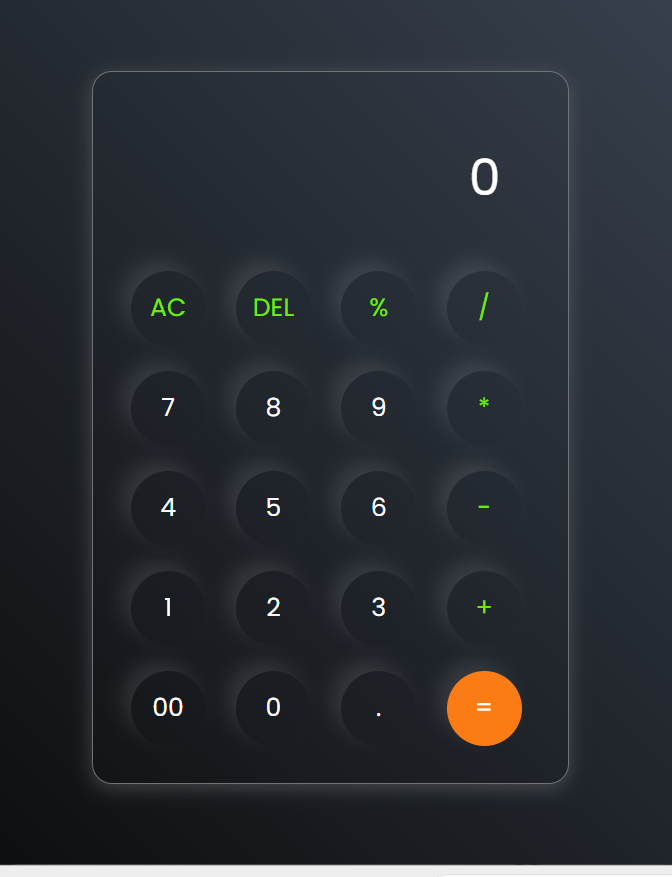

# 🧮 Calculator

A simple and responsive calculator built using **HTML**, **CSS**, and **JavaScript**.

## 🚀 Features

- Basic arithmetic operations
- Clear (AC) button
- Delete (DEL) button
- Percentage (%)
- Decimal support
- Responsive UI
- Modern dark theme

## 🛠️ Technologies Used

- HTML5
- CSS3
- JavaScript (DOM Manipulation)


## 📁 Project Structure

```
Calculator/
│── index.html
│── style.css
│── script.js
│── README.md
```

## 🎯 What I Learned

- DOM Manipulation
- Event Listeners
- JavaScript Functions
- String Manipulation
- CSS Flexbox
- Responsive Design
- Git & GitHub

## 📸 Screenshot



## 👨‍💻 Author

**Kunal**